# Construction-Excel-Bookkeeping-System

## Overview
This project demonstrates an end-to-end bookkeeping and reconciliation workflow built in Excel using Power Query (M language), data validation, and accounting principles for Q1 of 2026.

The workflow transforms raw financial data into structured accounting records, including journal entries, chart of accounts mapping, bank reconciliation, and financial reporting through pivot tables and dashboards.

---

## 1. Raw Financial Data
The project begins with an unstructured bank statement requiring cleaning and transformation.

Text to Columns was used to separate transaction fields and properly structure headers before loading the data into Power Query.

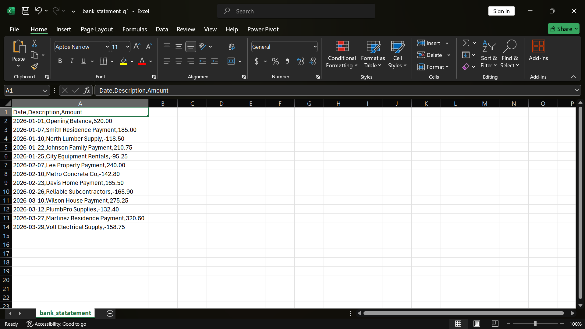

---

## 2. Data Integration (Bank, AR & AP)
Bank statement data was loaded and combined with accounts receivable and accounts payable datasets to prepare the system for reconciliation.

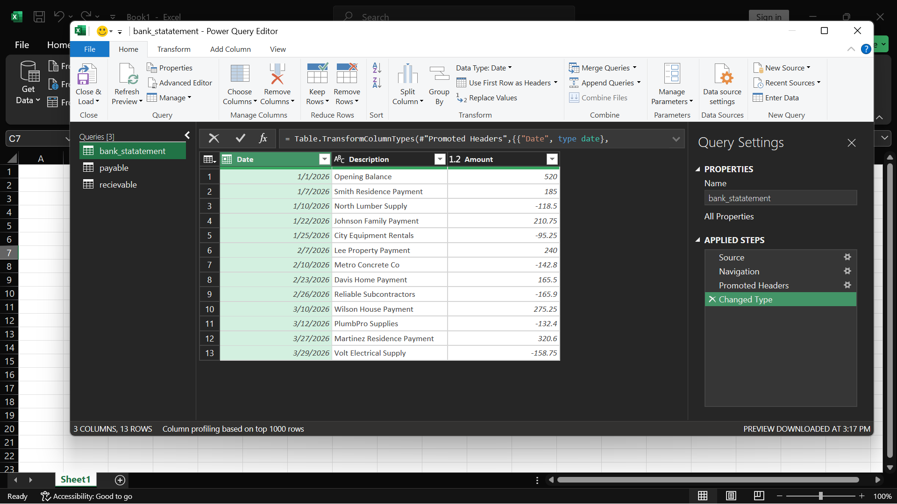

---

## 3. Data Transformation (Power Query + M Language)
Power Query was used to clean and transform the integrated dataset. Conditional logic and M language were applied to structure, classify, and prepare data for accounting workflows.

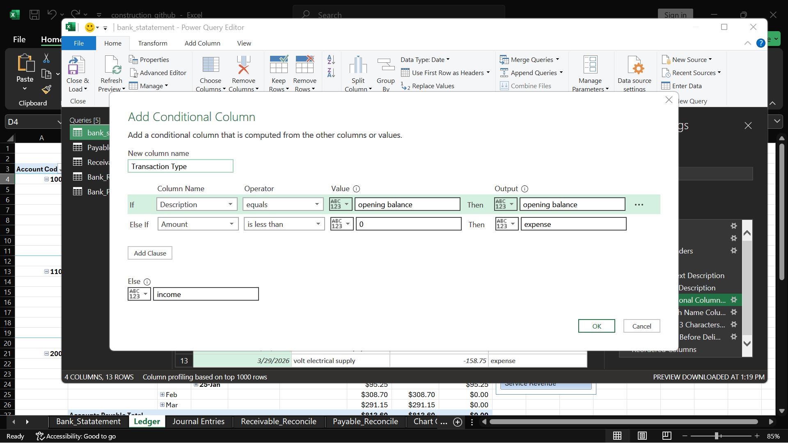

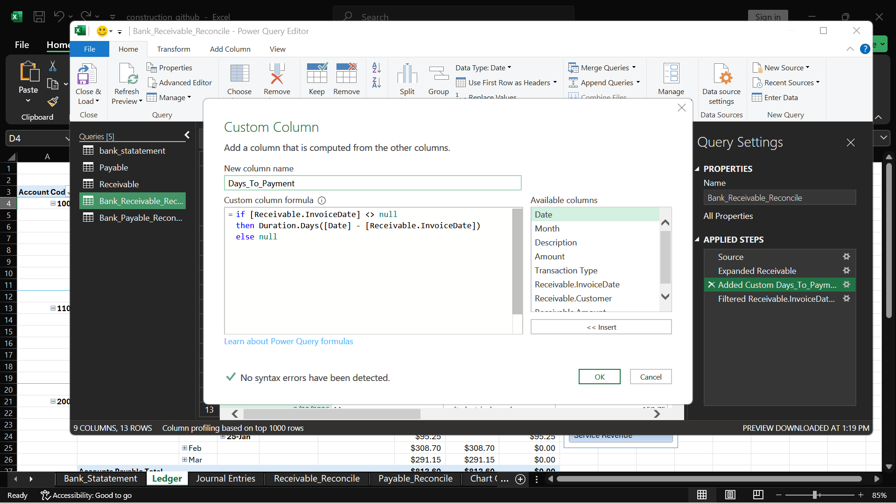

---

## 4. Bank Reconciliation
Bank transactions were merged with accounting records to perform reconciliation and verify financial consistency.

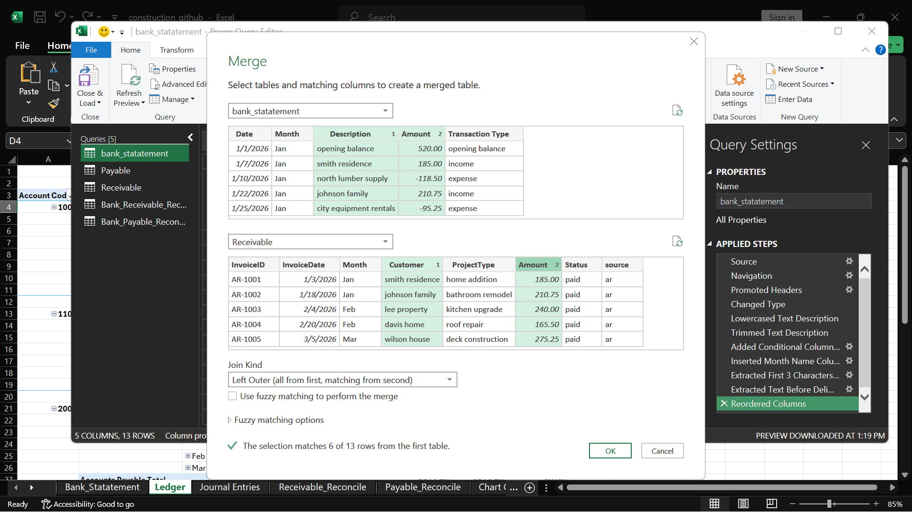

---

## 5. Chart of Accounts Structure
A structured chart of accounts was created to ensure correct classification of financial transactions.
Account categories and codes were structured to maintain consistent financial classification across journal entries and reporting.

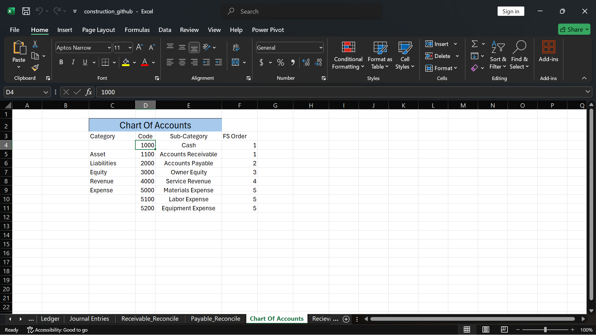

---

## 6. Journal Entries (Double-Entry Accounting)
Journal entries were created using double-entry accounting principles, ensuring all debits and credits were properly balanced.

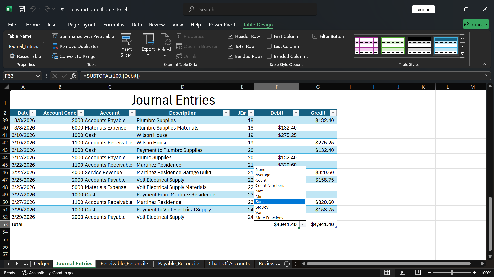

---

## 7. Data Validation Controls
Data validation rules were applied to ensure journal entries matched valid chart of accounts codes, improving accuracy and reducing errors.

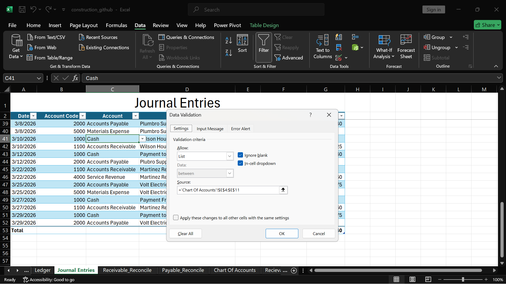

---

## 8. Account Mapping (XLOOKUP Logic)
XLOOKUP was used to map journal entries to the correct chart of accounts for accurate financial classification.

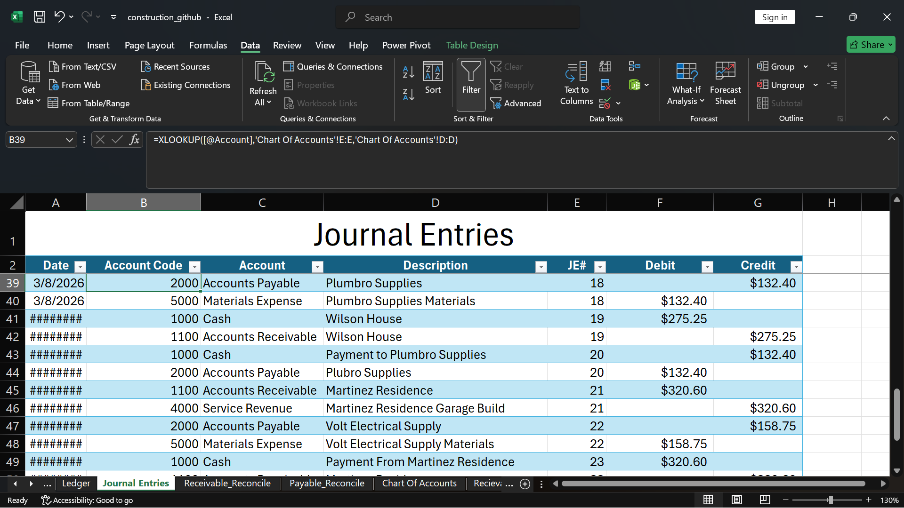

---

## 9. Financial Reporting (Pivot Table Analysis)
Pivot tables were used to analyze debit vs credit activity and summarize financial performance.
A calculated field was added to show profit and loss. 
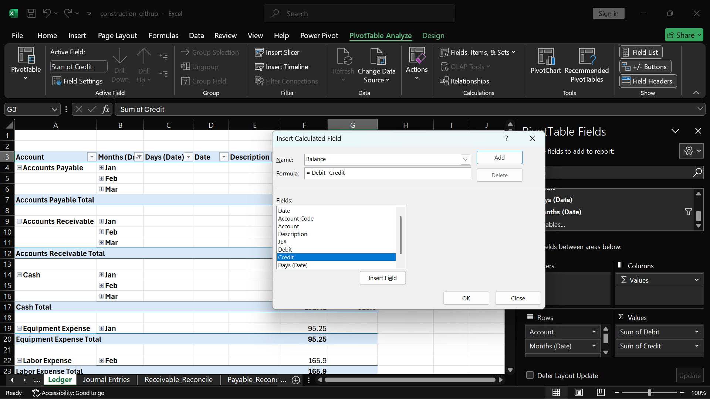

---

## 10. Interactive Dashboard (Slicers)
A final dashboard was built using pivot tables and slicers for interactive financial analysis.

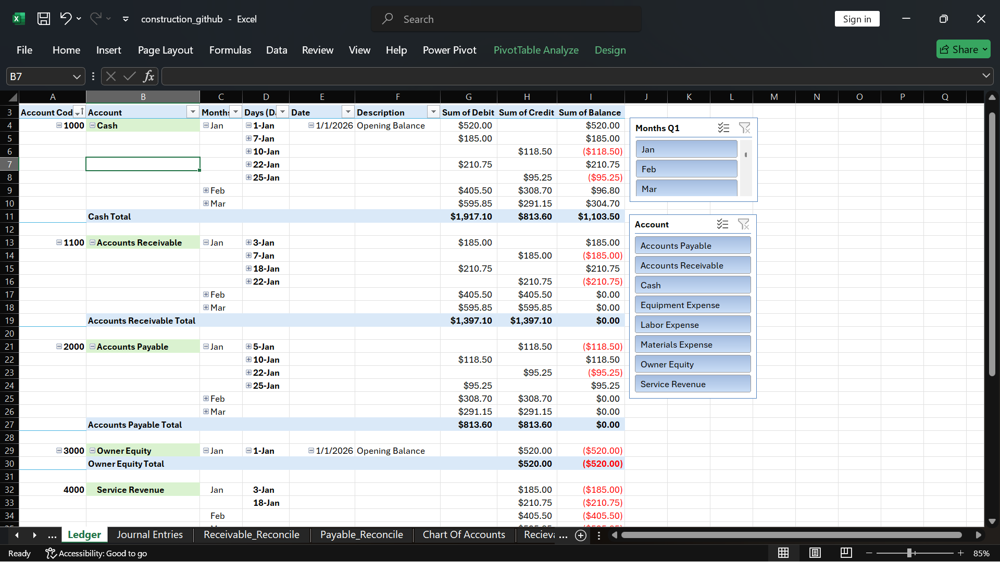

---

## 📁 Project File Access
- Here is the link to access my project and explore further into what I did in this project. 

- 📊 Excel Workbook:
  [Download Full Project File](construction_github.xlsx)

> ⚠️ Note: Open in Microsoft Excel Desktop for full Power Query steps, data model structure, and pivot dashboard functionality.  
> Click the file above to view or download raw data.

---

## Key Skills Demonstrated
- Microsoft Excel (Advanced)
- Power Query (ETL / Data transformation)
- M Language (calculated logic)
- Data validation systems
- Chart of Accounts structuring
- Double-entry bookkeeping
- Bank reconciliation
- XLOOKUP mapping
- Pivot tables & dashboard creation
- Financial reporting & analysis

---

## Project Outcome
This project simulates an accounting workflow:

**Data ingestion → Loading → Transformation → Reconciliation → Classification → Journal Entries → Ledger → Reporting**

---

## Author

This project was built as a way to simulate how real bookkeeping systems are structured and how raw financial data moves through an accounting workflow.

The focus wasn’t just on using Excel tools, but on thinking through the accounting process step by step — from how transactions are recorded, to how they are classified, and ultimately how they reconcile back to source data.

A key part of the design was making sure each stage of the workflow mirrored real accounting logic:
- ensuring data integrity before journal entry creation
- enforcing consistency through validation rules
- using Power Query to replicate a structured ETL-style process
- and building reconciliation logic that reflects real-world financial control processes

Rather than treating this as a collection of Excel features, the goal was to build a small, functional system that reflects how accounting data actually flows in practice.

---

## Challenges & Improvements

One of the main challenges in this project was balancing structure with flexibility — especially when designing the reconciliation process and ensuring that all transaction flows remained consistent across different data sources.

In future iterations, this system could be improved by:
- introducing a proper general ledger module with automated posting logic
- expanding reconciliation rules to handle edge cases (timing differences, missing transactions)
  
---

## Future Projects

This project represents a foundational stage in a broader accounting system build.

Upcoming projects will aim to complete the full accounting cycle, including:
- accounts receivable aging and customer balance tracking
- accounts payable management and due date tracking
- trial balance generation from journal entries
- financial statement preparation (income statement, balance sheet, cash flow)
- and a more complete end-to-end accounting system that integrates all financial modules

The goal is to evolve this from a spreadsheet-based workflow into a fully structured accounting system that mirrors real-world financial reporting environments.
